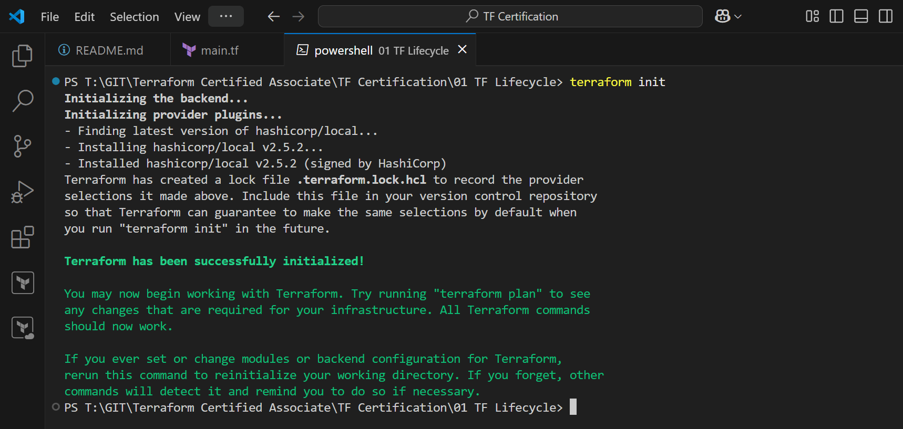
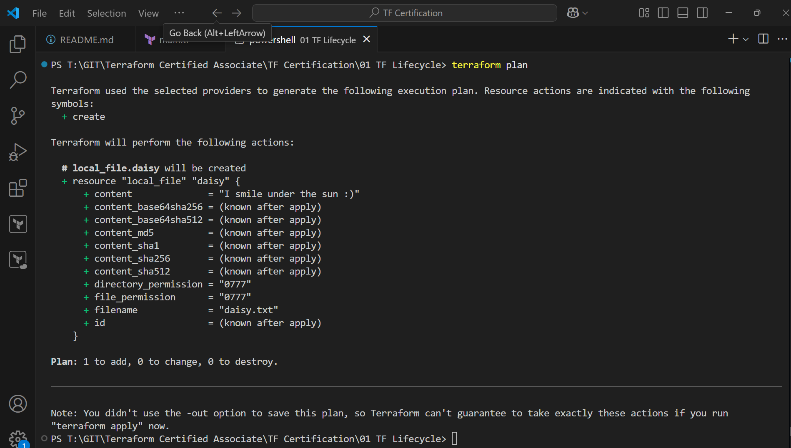
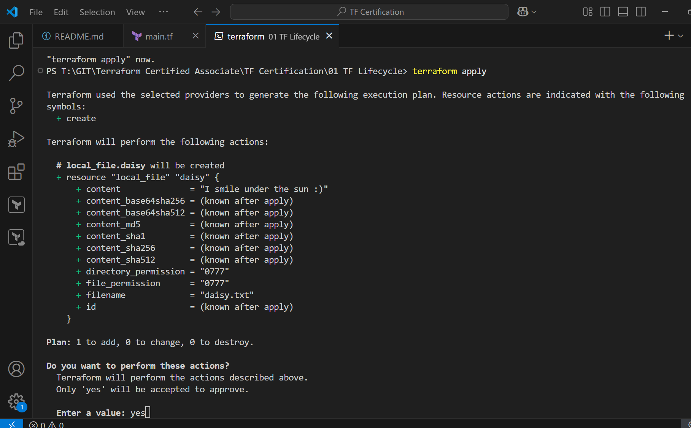
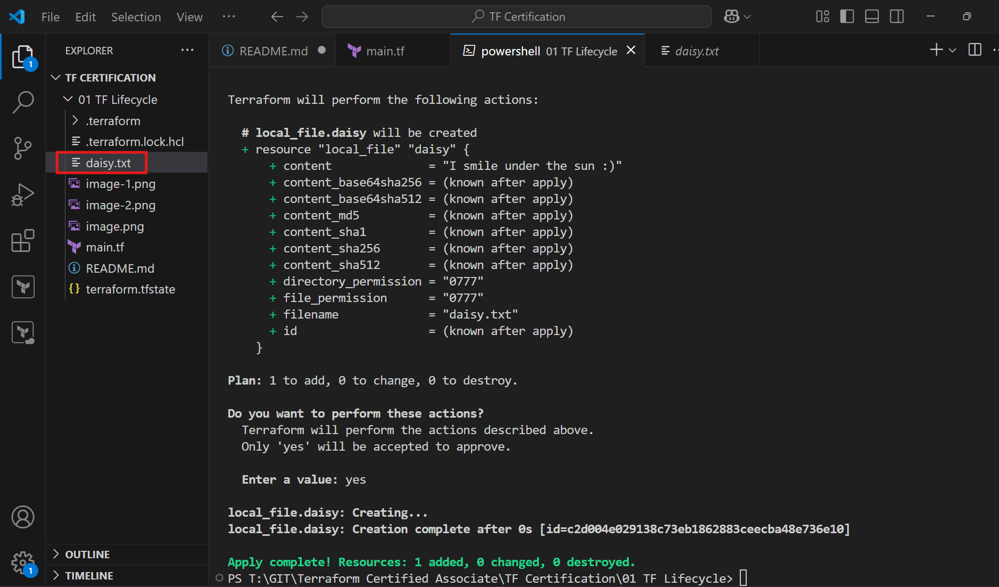
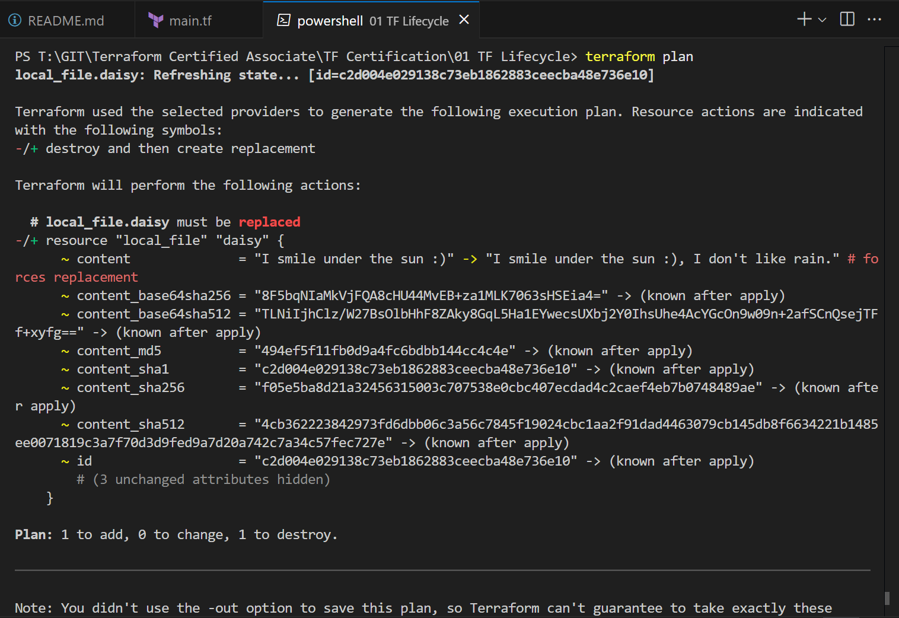
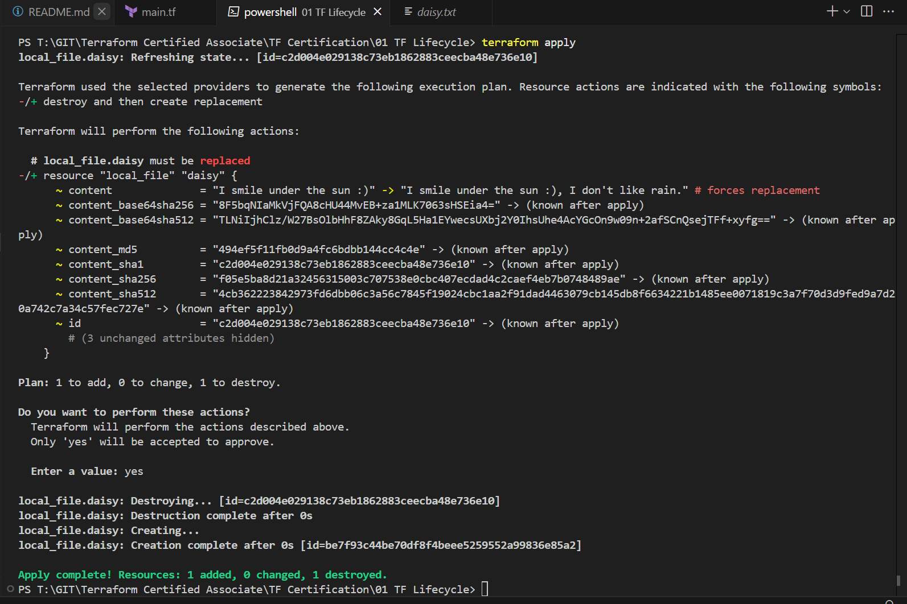
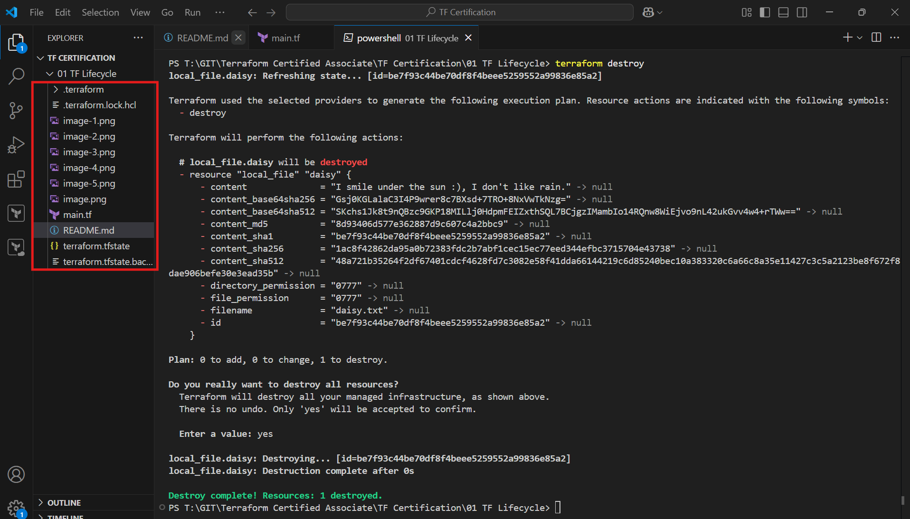

Terraform Init



Execute One
```js

resource "local_file" "daisy"{
    filename = "daisy.txt"
    content = "I smile under the sun :)"
}
```
Terraform Plan



Terraform Apply



Outcome



Execute Two
```js

resource "local_file" "daisy"{
    filename = "daisy.txt"
    content = "I smile under the sun :), I don't like rain."
}

```
Terraform Plan


Terraform Apply


Terraform Destroy
