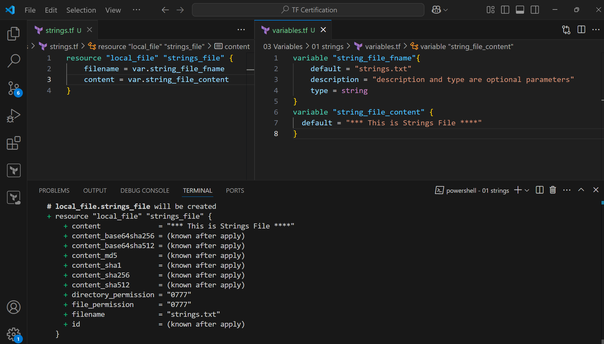

Execute

strings.tf
```js
resource "local_file" "strings_file" {
    filename = var.string_file_fname
    content = var.string_file_content
}
```
variables.tf
```js
variable "string_file_fname"{
    default = "strings.txt"
    description = "description and type are optional parameters"
    type = string
}
variable "string_file_content" {
  default = "*** This is Strings File ****"
}
```

Terraform plan


Terraform Apply


Terraform show
