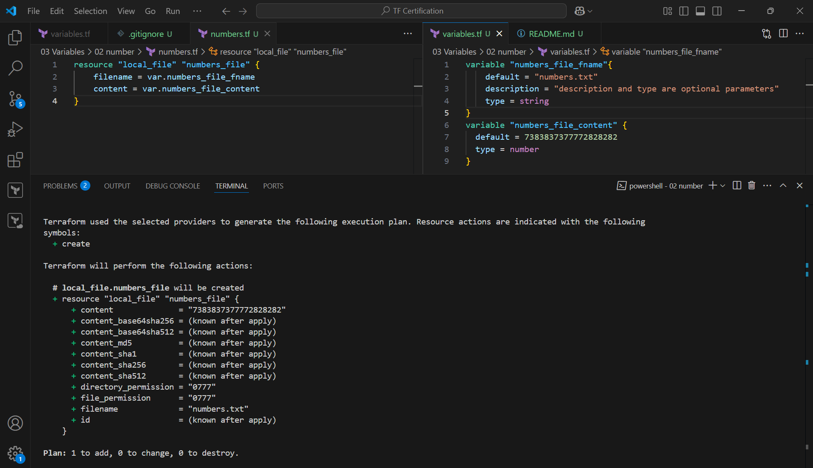
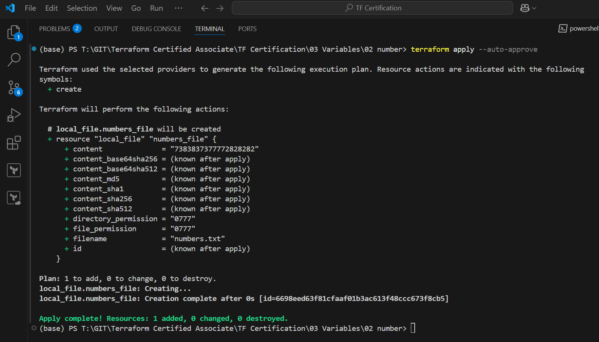
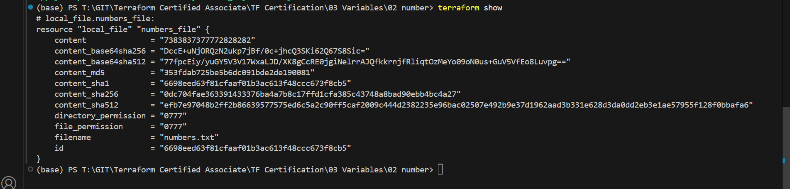

Execute

numbers.tf
```js
resource "local_file" "numbers_file" {
    filename = var.numbers_file_fname
    content = var.numbers_file_content
}
```
variables.tf
```js
variable "numbers_file_fname"{
    default = "numbers.txt"
    description = "description and type are optional parameters"
    type = string
}
variable "numbers_file_content" {
  default = 7383837377772828282
  type = number
}
```

Terraform plan


Terraform Apply


Terraform show
