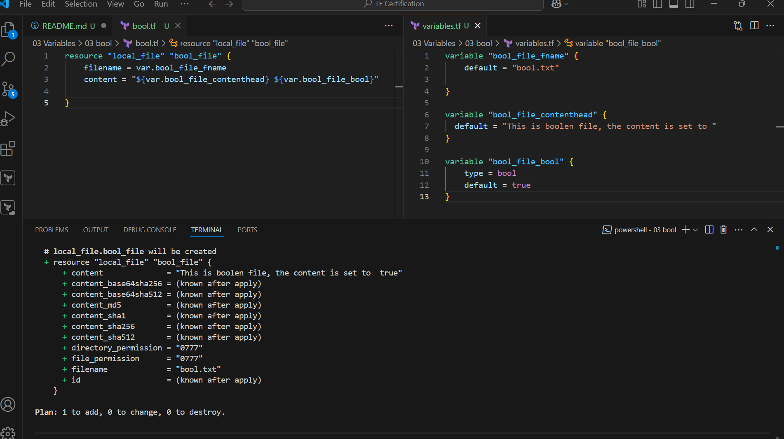
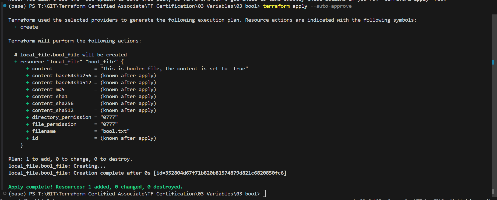
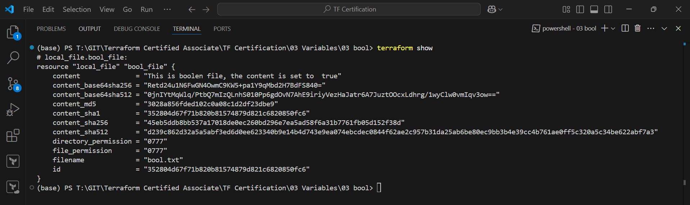

Execute

bool.tf
```js
resource "local_file" "bool_file" {
    filename = var.bool_file_fname
    content = "${var.bool_file_contenthead} ${var.bool_file_bool}"
  
}
```
variables.tf
```js
variable "bool_file_fname" {
    default = "bool.txt"
  
}

variable "bool_file_contenthead" {
  default = "This is boolen file, the content is set to "
}

variable "bool_file_bool" {
    type = bool
    default = true
}
```

Terraform plan


Terraform Apply


Terraform show
