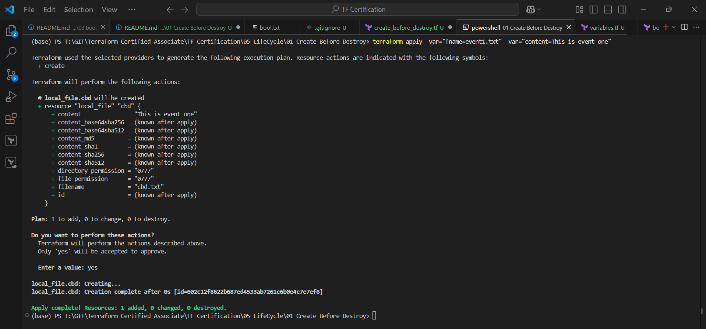
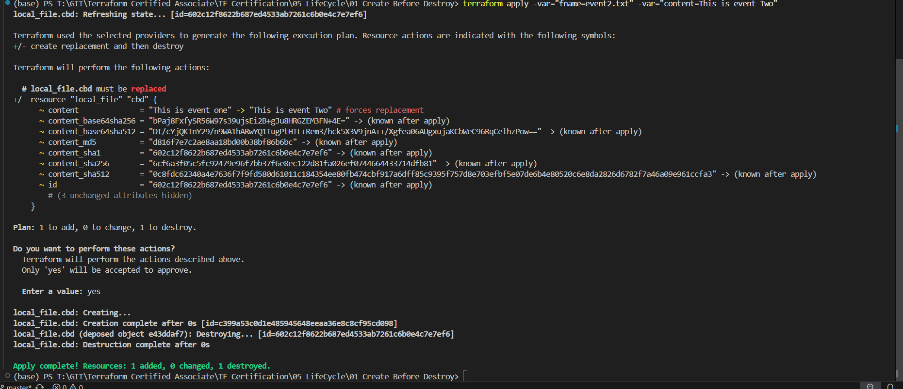

This is just an example

Terraform Apply
```sh
terraform apply -var="fname=event1.txt" -var="content=This is event one"
```



Terraform Apply
```sh
terraform apply -var="fname=event2.txt" -var="content=This is event Two"
```
